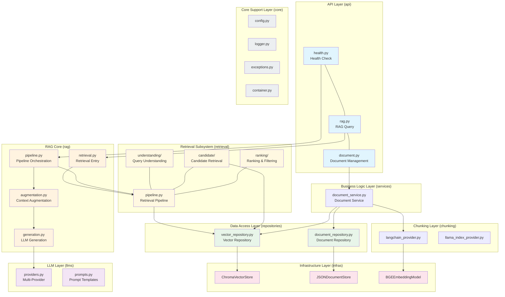
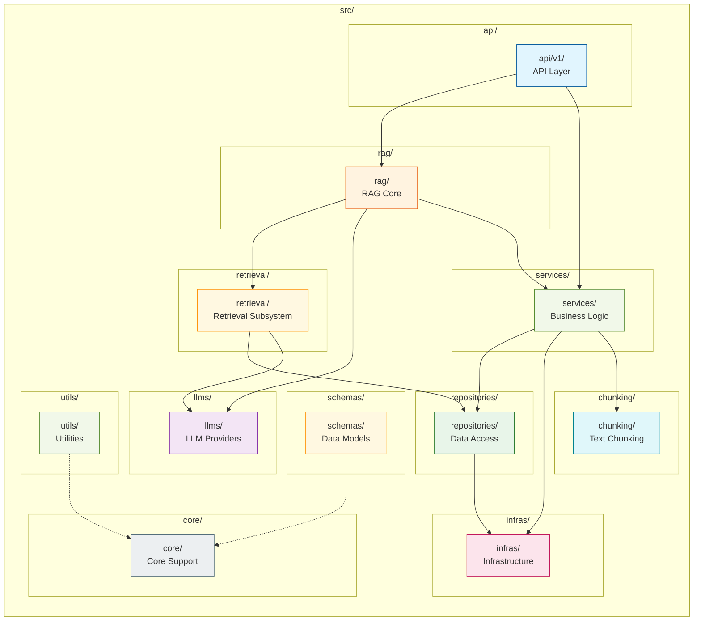
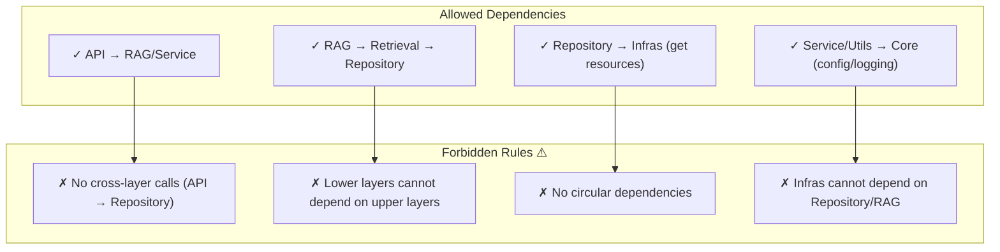

# x-rag: Production-Ready RAG Learning Project

[](https://opensource.org/licenses/MIT)
[](https://www.python.org/downloads/)
[](https://github.com/astral-sh/ruff)

> **中文**: [README.md](./README.md)

## Project Overview

x-rag is a **production-grade RAG (Retrieval-Augmented Generation) learning and training project**, following backend industry-standard engineering practices with a clear layered, modular, highly extensible, and maintainable architecture.

### Core Values

- **Layered Architecture**: Standard five-layer business architecture + universal core support layer, completely isolated from web framework
- **Modular Design**: Core support layer can be reused across RESTful API, scheduled tasks, message consumers, offline scripts, and unit tests
- **Ready to Use**: Supports multi-environment switching and containerized deployment, enabling rapid enterprise RESTful API backend setup
- **Engineering Standards**: PEP8 compliance, complete type annotations, production-grade logging and exception handling

## Core Features

- **OOP Retrieval Pipeline**: Three-stage pluggable architecture — Query Understanding, Candidate Retrieval, Ranking & Filtering; each stage supports multiple swappable Provider implementations
- **Vector Retrieval**: Chroma vector store integration with BGE-M3 multilingual embedding model
- **Smart Retrieval**: Supports MMR, RRF, Semantic Reranking and other ranking algorithms for improved retrieval diversity
- **Flexible Splitting**: Multiple text splitting strategies — character, word, sentence, paragraph, and semantic levels via LangChain / LlamaIndex
- **Multi-LLM Support**: DeepSeek, Doubao, Aliyun (Qwen), Xiaomi Mimo, and other major LLM providers
- **Dependency Injection**: Built-in universal IOC container with singleton/transient support
- **Middleware Support**: CORS, rate limiting, request tracing, unified exception handling

## Project Structure

```
x-rag/
├── src/                          # Core source code
│   ├── api/                      # API interface layer
│   │   ├── router.py             # Route registration
│   │   └── v1/                   # API v1
│   │       ├── health.py          # Health check
│   │       ├── rag.py            # RAG endpoints
│   │       └── document.py        # Document management
│   ├── rag/                      # RAG core module
│   │   ├── pipeline.py           # RAG pipeline orchestration
│   │   ├── retrieval.py          # Retrieval entry (delegates to Pipeline)
│   │   ├── augmentation.py       # Context augmentation
│   │   └── generation.py         # LLM generation
│   ├── retrieval/                # Retrieval subsystem (OOP 3-stage)
│   │   ├── pipeline.py           # Retrieval pipeline orchestration
│   │   ├── understanding/       # Stage 1 — Query Understanding
│   │   │   ├── base.py           # Abstract base class
│   │   │   ├── rewrite.py        # Query rewrite
│   │   │   ├── expansion.py      # Query expansion
│   │   │   ├── hyde.py          # Hypothetical Document (HyDE)
│   │   │   └── subquery.py       # Subquery decomposition
│   │   ├── candidate/           # Stage 2 — Candidate Retrieval
│   │   │   ├── base.py           # Abstract base class
│   │   │   ├── vector_retrieval.py  # Vector ANN retrieval
│   │   │   └── keyword_retrieval.py  # BM25 keyword retrieval
│   │   └── ranking/             # Stage 3 — Ranking & Filtering
│   │       ├── base.py           # Abstract base class
│   │       ├── mmr.py            # MMR diversity reranking
│   │       ├── rrf.py            # RRF rank fusion
│   │       ├── semantic.py        # LLM semantic reranking
│   │       └── score_filter.py    # Score threshold filtering
│   ├── llms/                     # LLM providers
│   │   ├── providers.py          # Multi-provider registry (DeepSeek/Doubao/Aliyun/Mimo)
│   │   └── prompts.py            # Prompt template management
│   ├── chunking/                 # Text splitting
│   │   ├── base.py               # Splitting abstract base class
│   │   ├── langchain_provider.py  # LangChain splitting
│   │   └── llama_index_provider.py # LlamaIndex splitting
│   ├── repositories/             # Data access layer
│   │   ├── base_repository.py    # Base repository class
│   │   ├── vector_repository.py  # Vector repository
│   │   └── document_repository.py # Document repository
│   ├── models/                   # ORM entity layer
│   │   ├── document.py           # Document entity
│   │   └── vector.py             # Vector record
│   ├── infras/                   # Infrastructure layer
│   │   ├── vector_store/         # Vector store
│   │   ├── document_store/       # Document store
│   │   └── embedding/             # Embedding model
│   ├── core/                     # Core support layer
│   │   ├── config.py            # Configuration center
│   │   ├── logger.py            # Logging module
│   │   ├── exceptions.py         # Exception definitions
│   │   └── container.py         # DI container
│   ├── schemas/                  # Data models
│   │   ├── rag.py               # RAG schemas
│   │   ├── document.py           # Document schemas
│   │   └── health.py            # Health schemas
│   ├── constants/                 # Constants
│   │   ├── rag.py               # RAG constants
│   │   ├── generation.py         # Generation constants
│   │   └── ...
│   ├── utils/                    # Utilities
│   │   ├── similarity.py         # Similarity search engine
│   │   ├── filters.py           # Metadata filter engine
│   │   ├── index_optimizer.py   # Vector index optimizer
│   │   ├── reranker.py          # Reranking utilities
│   │   └── text_splitter.py     # Text splitting utilities
│   └── main.py                   # Application entry
├── tests/                        # Test cases
├── examples/                     # Example code
├── scripts/                      # Operations scripts
├── docs/                         # Documentation
├── .github/workflows/            # GitHub Actions
├── .pre-commit-config.yaml     # Pre-commit config
├── config.yaml                  # Configuration file
├── .env.example                # Environment template
├── docker-compose.yml          # Docker compose
├── Dockerfile                  # Docker image
├── pyproject.toml             # Project config (uv)
├── CHANGELOG.md              # Changelog
├── LICENSE                   # MIT License
└── README.md                # This file
```

## System Architecture

### Retrieval Pipeline Architecture (Key Feature)

```
User Query
    │
    ▼
┌─────────────────────────────────────────────────────────────┐
│  Stage 1: Query Understanding (parallel → merge)          │
│                                                             │
│  ┌────────────────┐ ┌────────────────┐ ┌────────────────┐ │
│  │ QueryRewrite   │ │QueryExpansion  │ │     HyDE       │ │
│  │ (LLM Rewrite) │ │(Synonym/Embed) │ │(Hypo. Doc)     │ │
│  └────────────────┘ └────────────────┘ └────────────────┘ │
│  ┌────────────────┐                                        │
│  │SubqueryDecomp  │                                        │
│  │(Subqueries)    │                                        │
│  └────────────────┘                                        │
│                          ↓ merge()                           │
│          processed_query + sub_queries                        │
│          + expanded_terms + hypothetical_doc                 │
└─────────────────────────────────────────────────────────────┘
    │
    ▼
┌─────────────────────────────────────────────────────────────┐
│  Stage 2: Candidate Retrieval (multi-source → dedup)         │
│                                                             │
│  ┌────────────────────────┐  ┌────────────────────────┐     │
│  │ ChromaVectorRetrieval  │  │   BM25Retriever       │     │
│  │   (Vector ANN)        │  │   (Keyword BM25)      │     │
│  └────────────────────────┘  └────────────────────────┘     │
│                          ↓ candidate set                     │
└─────────────────────────────────────────────────────────────┘
    │
    ▼
┌─────────────────────────────────────────────────────────────┐
│  Stage 3: Ranking & Filtering (sequential)                  │
│                                                             │
│  MMRReranker ──→ RRFReranker ──→ SemanticReranker         │
│  (Diversity)      (Rank Fusion)    (Semantic)               │
│                          ↓                                   │
│                   ScoreFilter (threshold)                     │
│                          ↓                                   │
│               Final Top-K Results                            │
└─────────────────────────────────────────────────────────────┘
```

### Layered Architecture Diagram



### Module Dependency Diagram



### Dependency Rules



## Quick Start

### Requirements

- Python 3.11+
- uv (recommended) or pip

### Clone Project

```bash
git clone https://github.com/yeyushilai/x-rag.git
cd x-rag
```

### Install Dependencies

```bash
# Using uv (recommended)
uv sync

# Or using pip
pip install -e .
```

### Configure Environment

```bash
# Copy environment template
cp .env.example .env

# Edit .env and add your API Key
DEEPSEEK_API_KEY=your-deepseek-api-key-here
```

### Start Service

```bash
# Development mode (hot reload)
uv run uvicorn src.main:app --reload

# Or using scripts
./scripts/start.sh   # Linux/macOS
.\scripts\start.ps1  # Windows
```

After starting, access:
- API Docs: http://localhost:8000/docs
- ReDoc: http://localhost:8000/redoc

### Docker Deployment

```bash
# Build and start
docker-compose up -d

# View logs
docker-compose logs -f
```

## Common Commands

```bash
# Run tests
uv run pytest tests/

# Format code
uv run ruff check src/ --fix
uv run ruff format src/

# Type checking
uv run mypy src/

# Install pre-commit hooks
uv run pre-commit install
```

## Tech Stack

| Category | Technology |
|----------|------------|
| Web Framework | FastAPI + Uvicorn |
| Data Storage | Chroma (Vector Database) |
| Embedding Model | BGE-M3 (BAAI Open Source) |
| LLM | DeepSeek / Doubao / Aliyun (Qwen) / Xiaomi Mimo |
| Text Chunking | LangChain / LlamaIndex |
| Logging | Loguru |
| DI Container | Custom IOC Container |
| Utilities | Pydantic, httpx, rank-bm25 |
| Containerization | Docker, docker-compose |
| CI/CD | GitHub Actions |
| Package Manager | uv |

## API Documentation

### Health Check

```bash
GET /api/v1/health
```

### Document Management

```bash
# Upload document
POST /api/v1/documents/upload

# List documents
GET /api/v1/documents

# Get document
GET /api/v1/documents/{document_id}

# Delete document
DELETE /api/v1/documents/{document_id}

# Get document status
GET /api/v1/documents/{document_id}/status
```

### RAG Query

```bash
# RAG Q&A
POST /api/v1/rag/query

# Retrieval only
POST /api/v1/rag/retrieve

# Text embedding
POST /api/v1/rag/embed

# Statistics
GET /api/v1/rag/stats
```

## Retrieval Subsystem Usage Guide

The `src/retrieval/` subsystem supports flexible Provider swapping. Typical usage:

```python
from retrieval.pipeline import RetrievalPipeline
from retrieval.understanding.rewrite import LLMQueryRewriter
from retrieval.understanding.expansion import EmbeddingExpander
from retrieval.candidate.vector_retrieval import ChromaVectorRetrieval
from retrieval.ranking.mmr import MMRReranker
from retrieval.ranking.score_filter import ScoreFilter
from utils.similarity import SimilaritySearchEngine, DistanceType

pipeline = RetrievalPipeline(
    understanding_providers=[
        LLMQueryRewriter(provider_name="deepseek"),
        EmbeddingExpander(embedding_model=embedding_model),
    ],
    candidate_providers=[
        ChromaVectorRetrieval(),
    ],
    reranking_providers=[
        MMRReranker(distance_type=DistanceType.COSINE),
        ScoreFilter(threshold=0.7),
    ],
    similarity_engine=SimilaritySearchEngine(distance_type=DistanceType.COSINE),
    default_top_k=5,
    default_threshold=0.7,
)

pipeline.initialize()
results = pipeline.retrieve(
    query="Query about RAG",
    top_k=5,
    use_mmr=True,
    mmr_lambda=0.5,
)
```

## License

This project is open source under [MIT License](./LICENSE).

## Contact

- Author: John Young
- Email: john.young@foxmail.com
- Gitee: https://gitee.com/yeyushilai
- GitHub: https://github.com/yeyushilai

## References

- [Python](https://docs.python.org/3.11/)
- [FastAPI](https://fastapi.tiangolo.com/)
- [uv](https://github.com/astral-sh/uv)
- [Chroma](https://docs.trychroma.com/)
- [Sentence Transformers](https://www.sbert.net/)
- [Pydantic](https://docs.pydantic.dev/)
- [rank-bm25](https://github.com/dorianbrown/rank_bm25)
