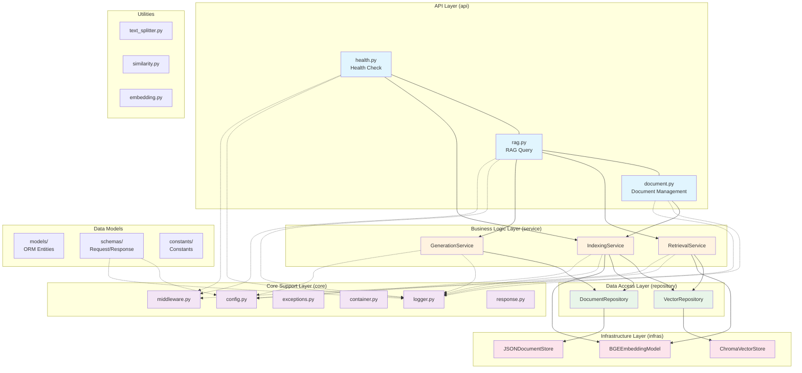
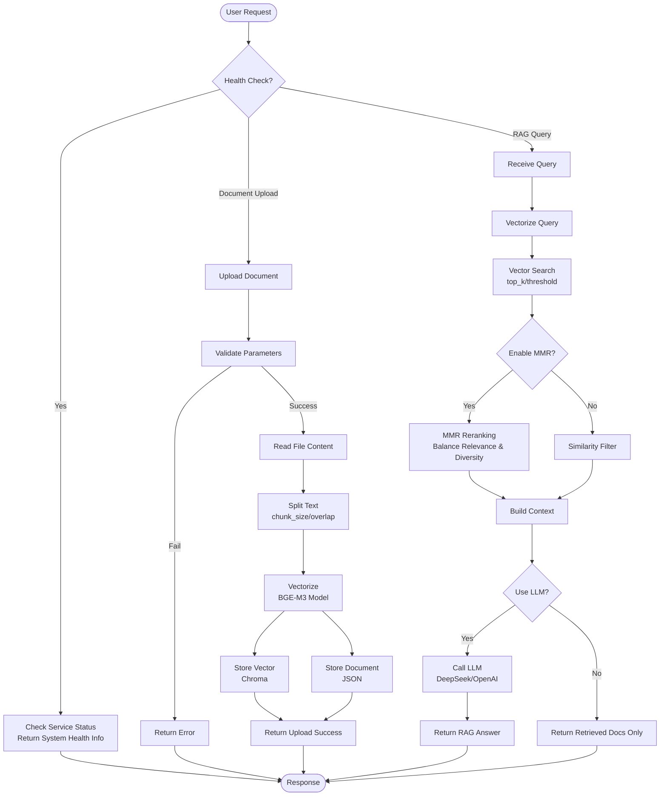
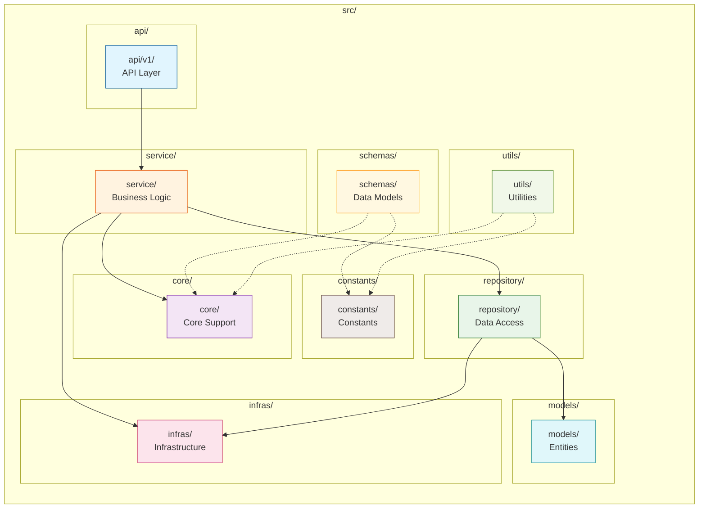
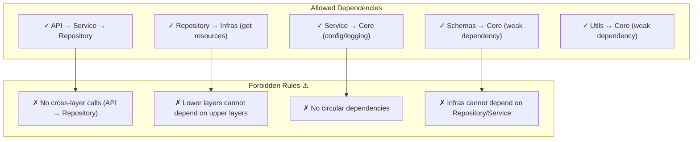

# x-rag: Production-Ready RAG Learning Project

[](https://opensource.org/licenses/MIT)
[](https://www.python.org/downloads/)
[](https://github.com/astral-sh/ruff)

> **中文**: [README.md](./README.md)

## Project Overview

x-rag is a **production-grade RAG (Retrieval-Augmented Generation) learning and training project**, following backend industry-standard engineering practices with a clear layered, modular, highly extensible, and maintainable architecture.

### Core Values

- **Layered Architecture**: Standard five-layer business architecture + universal core support layer, completely isolated from web framework
- **Modular Design**: Core support layer can be reused across RESTful API, scheduled tasks, message consumers, offline scripts, and unit tests
- **Ready to Use**: Supports multi-environment switching and containerized deployment, enabling rapid enterprise RESTful API backend setup
- **Engineering Standards**: PEP8 compliance, complete type annotations, production-grade logging and exception handling

## Core Features

- **Vector Retrieval**: Chroma vector store integration with BGE-M3 multilingual embedding model
- **Smart Retrieval**: MMR (Maximal Marginal Relevance) reranking for improved retrieval diversity
- **Flexible Splitting**: Multiple text splitting strategies - character, word, sentence, paragraph, and semantic
- **Multi-LLM Support**: DeepSeek, OpenAI, and other major LLM providers
- **Dependency Injection**: Built-in universal IOC container with singleton/transient support
- **Middleware Support**: CORS, rate limiting, request tracing, unified exception handling

## Project Structure

```
x-rag/
├── src/                          # Core source code
│   ├── api/                      # API interface layer
│   │   ├── router.py             # Route registration
│   │   └── v1/                   # API v1
│   │       ├── health.py          # Health check
│   │       ├── rag.py            # RAG endpoints
│   │       └── document.py        # Document management
│   ├── service/                  # Business logic layer
│   │   ├── indexing_service.py    # Indexing service
│   │   ├── retrieval_service.py   # Retrieval service
│   │   └── generation_service.py # Generation service
│   ├── repository/               # Data access layer
│   │   ├── vector_repository.py  # Vector repository
│   │   └── document_repository.py # Document repository
│   ├── models/                  # ORM entity layer
│   │   ├── document.py           # Document entity
│   │   └── vector.py            # Vector record
│   ├── infras/                  # Infrastructure layer
│   │   ├── vector_store/         # Vector store
│   │   ├── document_store/       # Document store
│   │   └── embedding/            # Embedding model
│   ├── core/                    # Core support layer
│   │   ├── config.py            # Configuration center
│   │   ├── logger.py            # Logging module
│   │   ├── exceptions.py         # Exception definitions
│   │   ├── container.py         # DI container
│   │   ├── middleware.py         # Middleware
│   │   └── response.py          # Response wrapper
│   ├── schemas/                  # Data models
│   │   ├── rag.py               # RAG schemas
│   │   ├── document.py           # Document schemas
│   │   └── health.py            # Health schemas
│   ├── constants/                # Constants
│   │   ├── common.py            # Common constants
│   │   ├── rag.py               # RAG constants
│   │   ├── generation.py         # Generation constants
│   │   └── ...
│   ├── utils/                   # Utilities
│   │   ├── text_splitter.py     # Text splitting
│   │   └── similarity.py         # Similarity calculation
│   └── main.py                   # Application entry
├── tests/                       # Test cases
│   ├── conftest.py              # Test configuration
│   └── unit/                    # Unit tests
├── examples/                    # Example code
├── scripts/                     # Operations scripts
│   ├── start.sh / start.ps1    # Start script
│   ├── test.sh / test.ps1      # Test script
│   └── format.sh / format.ps1  # Format script
├── docs/                        # Documentation
├── .github/workflows/            # GitHub Actions
├── .pre-commit-config.yaml     # Pre-commit config
├── config.yaml                  # Configuration file
├── .env.example                 # Environment template
├── docker-compose.yml           # Docker compose
├── Dockerfile                   # Docker image
├── pyproject.toml              # Project config
├── CHANGELOG.md               # Changelog
├── LICENSE                     # MIT License
└── README.md                  # This file
```

## System Architecture

### Layered Architecture Diagram



### Core Business Flow Diagram



### Module Dependency Diagram



### Dependency Rules



## Quick Start

### Requirements

- Python 3.11+
- uv (recommended) or pip

### Clone Project

```bash
git clone https://github.com/yeyushilai/x-rag.git
cd x-rag
```

### Install Dependencies

```bash
# Using uv (recommended)
uv sync

# Or using pip
pip install -e .
```

### Configure Environment

```bash
# Copy environment template
cp .env.example .env

# Edit .env and add your API Key
DEEPSEEK_API_KEY=your-deepseek-api-key-here
```

### Start Service

```bash
# Development mode (hot reload)
uv run uvicorn src.main:app --reload

# Or using scripts
./scripts/start.sh   # Linux/macOS
.\scripts\start.ps1  # Windows
```

After starting, access:
- API Docs: http://localhost:8000/docs
- ReDoc: http://localhost:8000/redoc

### Docker Deployment

```bash
# Build and start
docker-compose up -d

# View logs
docker-compose logs -f
```

## Common Commands

```bash
# Run tests
uv run pytest tests/

# Format code
uv run ruff check src/ --fix
uv run ruff format src/

# Type checking
uv run mypy src/

# Install pre-commit hooks
uv run pre-commit install
```

## Tech Stack

| Category | Technology |
|----------|------------|
| Web Framework | FastAPI + Uvicorn |
| Data Storage | Chroma (Vector Database) |
| Embedding Model | BGE-M3 (BAAI Open Source) |
| LLM | DeepSeek / OpenAI |
| Logging | Loguru |
| DI Container | Custom IOC Container |
| Utilities | Pydantic, httpx |
| Containerization | Docker, docker-compose |
| CI/CD | GitHub Actions |

## API Documentation

### Health Check

```bash
GET /api/v1/health
```

### Document Management

```bash
# Upload document
POST /api/v1/documents/upload

# List documents
GET /api/v1/documents

# Get document
GET /api/v1/documents/{document_id}

# Delete document
DELETE /api/v1/documents/{document_id}

# Get document status
GET /api/v1/documents/{document_id}/status
```

### RAG Query

```bash
# RAG Q&A
POST /api/v1/rag/query

# Retrieval only
POST /api/v1/rag/retrieve

# Text embedding
POST /api/v1/rag/embed

# Statistics
GET /api/v1/rag/stats
```

## License

This project is open source under [MIT License](./LICENSE).

## Contact

- Author: John Young
- Email: john.young@foxmail.com
- Gitee: https://gitee.com/yeyushilai
- GitHub: https://github.com/yeyushilai

## References

- [Python](https://docs.python.org/3.11/)
- [FastAPI](https://fastapi.tiangolo.com/)
- [uv](https://github.com/astral-sh/uv)
- [Chroma](https://docs.trychroma.com/)
- [Sentence Transformers](https://www.sbert.net/)
- [Pydantic](https://docs.pydantic.dev/)
