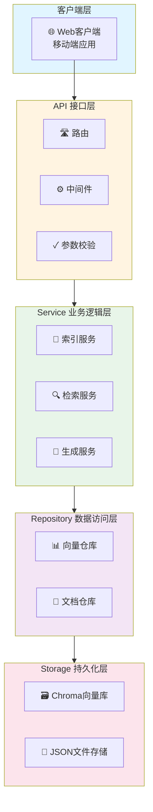
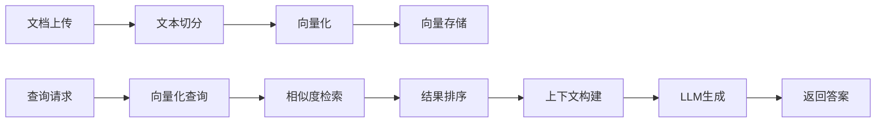

# x-rag

<div align="center">

一个生产级的 RAG（检索增强生成）学习和实训项目。

[](https://www.python.org/downloads/)
[](https://opensource.org/licenses/MIT)
[](https://github.com/psf/black)

</div>

## 项目简介

x-rag 是一个生产级的 RAG 学习和实训项目，提供了标准化、模块化、高可扩展、高可维护的后端服务基础架构。项目完整实现了 RAG 的全流程，包括离线索引构建、在线查询检索和增强生成。

### 核心特征

- 🏗️ **标准三层架构**：API 层、Service 层、Repository 层，严格分层依赖
- 🔧 **依赖注入**：依赖注入容器，支持单例/多例管理
- 📝 **完整文档**：中英文双语文档，包含详细的架构说明和使用示例
- 🧪 **测试覆盖**：单元测试和集成测试，保证代码质量
- 🚀 **Docker 支持**：开箱即用的 Docker 镜像和 docker-compose 配置
- 🔌 **热重载**：开发模式支持热重载，提高开发效率
- 📊 **多向量模型**：支持 BGE-M3 等主流向量模型
- 🗃️ **多向量存储**：基于 Chroma 的向量存储，支持持久化
- 🤖 **多 LLM 提供商**：支持 OpenAI、DeepSeek、阿里云通义千问等

## 项目结构

```
x-rag/
├── src/                        # 核心业务代码
│   ├── api/                    # API接口层
│   │   ├── router.py           # 路由注册
│   │   └── v1/                 # v1版本接口
│   │       ├── health.py       # 健康检查
│   │       ├── rag.py          # RAG接口
│   │       └── document.py     # 文档管理接口
│   ├── service/                # 业务逻辑层
│   │   ├── indexing_service.py # 索引构建服务
│   │   ├── retrieval_service.py# 检索服务
│   │   └── generation_service.py# 生成服务
│   ├── repository/             # 数据访问层
│   │   ├── vector_repository.py# 向量仓库
│   │   └── document_repository.py# 文档仓库
│   ├── core/                   # 核心支撑层
│   │   ├── config.py           # 配置中心
│   │   ├── logger.py           # 日志模块
│   │   ├── exceptions.py       # 异常定义
│   │   ├── middleware.py       # 中间件
│   │   └── container.py        # 依赖注入容器
│   ├── common/                 # 公共组件
│   │   ├── constants.py        # 常量定义
│   │   ├── schemas.py          # 数据模型
│   │   └── responses.py        # 响应格式
│   └── utils/                  # 工具函数
│       ├── text_splitter.py    # 文本切分工具
│       ├── embedding.py        # 向量化工具（BGE-M3）
│       └── similarity.py       # 相似度计算工具
├── examples/                   # 使用示例
│   ├── basic_rag.py            # 基础RAG示例
│   └── document_processing.py  # 文档处理示例
├── tests/                      # 测试目录
│   ├── unit/                   # 单元测试
│   ├── integration/            # 集成测试
│   └── conftest.py             # pytest配置
├── scripts/                    # 部署脚本
│   ├── start.sh                # 启动脚本
│   ├── test.sh                 # 测试脚本
│   └── format.sh               # 格式化脚本
├── config/                     # 配置文件
├── pyproject.toml              # 项目依赖管理
├── Dockerfile                  # Docker镜像
├── docker-compose.yml          # Docker编排
├── .env                        # 环境变量
├── .env.example                # 环境变量示例
├── config.yaml                 # 配置文件
└── README.md                   # 项目文档
```

## 系统架构

### 系统分层架构



### 核心功能业务流程



## 快速开始

### 环境要求

#### Windows 系统

- **Python**: 3.11 或更高版本
- **操作系统**: Windows 10/11
- **依赖包管理器**: uv

```powershell
# 检查Python版本
python --version
# 应显示 Python 3.11.x 或更高版本

# 检查是否已安装uv
uv --version
# 如果未安装，会提示安装命令
```

#### Linux/Mac 系统

- **Python**: 3.11 或更高版本
- **操作系统**: Linux (Ubuntu 20.04+, Debian 11+, Arch Linux 等), macOS 12+
- **依赖包管理器**: uv

```bash
# 检查Python版本
python --version
# 应显示 Python 3.11.x 或更高版本

# 检查是否已安装uv
uv --version
# 如果未安装，会提示安装命令
```

### 项目克隆

```bash
# 克隆项目仓库
git clone https://gitee.com/yeyushilai/x-rag.git

# 进入项目目录
cd x-rag
```

### 依赖安装

#### 安装 uv（如果尚未安装）

```bash
# Linux/Mac
curl -LsSf https://astral.sh/uv/install.sh | sh

# Windows PowerShell
powershell -c "irm https://astral.sh/uv/install.ps1 | iex"
```

#### 同步依赖

```bash
# 安装项目依赖
uv sync

# 或仅安装生产依赖
uv sync --group prod
```

### 配置文件创建

#### .env 配置

复制 `.env.example` 为 `.env` 并修改关键配置：

```bash
cp .env.example .env
```

编辑 `.env` 文件，配置以下关键参数：

```bash
# ====================================
# LLM配置
# ====================================
GENERATION_PROVIDER=deepseek
GENERATION_MODEL=deepseek-chat
DEEPSEEK_API_KEY=your_api_key_here

# ====================================
# 向量模型配置
# ====================================
EMBEDDING_MODEL=BAAI/bge-m3
EMBEDDING_DEVICE=cpu
EMBEDDING_BATCH_SIZE=32
EMBEDDING_CACHE_SIZE=1000

# ====================================
# 服务配置
# ====================================
SERVER_HOST=0.0.0.0
SERVER_PORT=8000
DEBUG=true
ENVIRONMENT=development

# ====================================
# 向量存储配置
# ====================================
VECTOR_STORE_PERSIST_DIR=./data/chroma
VECTOR_STORE_COLLECTION_NAME=documents
VECTOR_STORE_DISTANCE=cosine

# ====================================
# 文本切分配置
# ====================================
TEXT_SPLITTER_CHUNK_SIZE=512
TEXT_SPLITTER_CHUNK_OVERLAP=50

# ====================================
# 检索配置
# ====================================
RETRIEVAL_TOP_K=5
RETRIEVAL_SIMILARITY_THRESHOLD=0.7
RETRIEVAL_USE_MMR=false

# ====================================
# API配置
# ====================================
API_PREFIX=/api/v1
```

#### config.yaml 配置

`config.yaml` 包含更详细的配置项，可根据需要调整：

```yaml
# 服务配置
server:
  host: 0.0.0.0
  port: 8000
  debug: false
  environment: development

# 日志配置
logging:
  level: INFO
  file_path: logs/app.log
  rotation: 1 day
  retention: 7 days

# 向量模型配置
embedding:
  model: BAAI/bge-m3
  device: cpu
  batch_size: 32
  cache_size: 1000
  normalize: true

# 向量存储配置
vector_store:
  type: chroma
  persist_directory: ./data/chroma
  collection_name: documents
  distance: cosine

# 文本切分配置
text_splitter:
  chunk_size: 512
  chunk_overlap: 50
  separators:
    - "\n\n"
    - "\n"
    - "。"
    - "！"
    - "？"
    - " "
    - ""

# 检索配置
retrieval:
  top_k: 5
  similarity_threshold: 0.7
  use_mmr: false
  mmr_lambda: 0.5

# 生成配置
generation:
  provider: deepseek
  model: deepseek-chat
  temperature: 0.7
  max_tokens: 2000
  timeout: 30
```

### 服务启动

#### 1. 本地开发模式启动

支持热重载和调试：

```bash
# 使用uv启动（推荐）
uv run python src/main.py

# 或使用uvicorn直接启动
uv run uvicorn src.main:app --host 0.0.0.0 --port 8000 --reload

# 使用启动脚本（Linux/Mac）
bash scripts/start.sh

# 使用启动脚本（Windows PowerShell）
powershell scripts/start.ps1
```

启动成功后可访问：
- API文档：`http://localhost:8000/docs`
- ReDoc文档：`http://localhost:8000/redoc`

#### 2. Docker 容器化部署

使用 Docker Compose 启动：

```bash
# 构建并启动服务
docker-compose up -d

# 查看服务状态
docker-compose ps

# 查看服务日志
docker-compose logs -f

# 停止服务
docker-compose down

# 重启服务
docker-compose restart
```

Docker 部署优势：
- 环境隔离
- 一键部署
- 易于扩展

### 常用命令

#### 测试相关

```bash
# 运行所有测试
uv run pytest tests/

# 运行单元测试
uv run pytest tests/unit/

# 运行集成测试
uv run pytest tests/integration/

# 生成覆盖率报告
uv run pytest --cov=src --cov-report=html --cov-report=term

# 查看覆盖率报告
# 打开 htmlcov/index.html 文件
```

#### 代码质量

```bash
# 代码格式化
uv run black src/ tests/ examples/

# 代码检查
uv run ruff check src/ tests/ examples/ --fix

# 类型检查
uv run mypy src/
```

#### 依赖管理

```bash
# 同步依赖
uv sync

# 添加依赖
uv add package-name

# 添加开发依赖
uv add --group dev package-name

# 更新依赖
uv sync --upgrade
```

## 技术栈

### Web 框架
- **FastAPI**: 现代、高性能的 Web 框架
- **Uvicorn**: ASGI 服务器

### 数据存储
- **Chroma**: 向量数据库
- **JSON**: 文档元数据存储

### 机器学习
- **Sentence-Transformers**: 文本向量化（BGE-M3）
- **NumPy**: 数值计算

### 工具库
- **Pydantic**: 数据验证和设置管理
- **Loguru**: 日志记录
- **PyYAML**: YAML 配置解析
- **httpx**: 异步 HTTP 客户端

### 部署工具
- **Docker**: 容器化
- **Docker Compose**: 服务编排

## API 文档

启动服务后，可以通过以下方式访问 API 文档：

### Swagger UI

交互式 API 文档：
```
http://localhost:8000/docs
```

### ReDoc

只读 API 文档：
```
http://localhost:8000/redoc
```

### OpenAPI JSON

OpenAPI 规范文档：
```
http://localhost:8000/openapi.json
```

## 主要 API 接口

### 系统接口

- `GET /api/v1/health` - 健康检查
- `GET /api/v1/version` - 版本信息
- `GET /api/v1/status` - 服务状态

### 文档管理

- `POST /api/v1/documents/upload` - 上传文档
- `GET /api/v1/documents` - 查询文档列表
- `GET /api/v1/documents/{id}` - 获取文档详情
- `DELETE /api/v1/documents/{id}` - 删除文档
- `GET /api/v1/documents/{id}/status` - 获取文档状态

### RAG 接口

- `POST /api/v1/rag/query` - RAG 查询
- `POST /api/v1/rag/retrieve` - 文档检索
- `POST /api/v1/rag/embed` - 文本向量化
- `GET /api/v1/rag/stats` - 系统统计

## 示例代码

### 基础 RAG 使用

```python
import asyncio
import httpx

async def rag_query(query: str):
    async with httpx.AsyncClient() as client:
        response = await client.post(
            "http://localhost:8000/api/v1/rag/query",
            json={
                "query": query,
                "top_k": 3,
                "similarity_threshold": 0.7
            }
        )
        result = response.json()
        return result

# 运行示例
answer = asyncio.run(rag_query("Python是什么？"))
print(answer["data"]["answer"])
```

更多示例请查看 [examples/](examples/) 目录。

## 存储配置

### 本地存储

项目默认使用本地存储：

- 向量数据：`./data/chroma`
- 文档元数据：`./data/documents`
- 日志文件：`./logs/`

### 对象存储

可以通过修改配置实现对象存储集成（待实现）。

## 许可证

本项目采用 MIT 许可证。详见 [LICENSE](LICENSE) 文件。

## 参考资料

- [FastAPI 官方文档](https://fastapi.tiangolo.com/)
- [Chroma 文档](https://docs.trychroma.com/)
- [Sentence-Transformers 文档](https://www.sbert.net/)
- [BGE-M3 模型](https://github.com/FlagOpen/FlagEmbedding)
- [Python 文档](https://docs.python.org/3.11/)

## 联系方式

- **作者**: John Young（网络昵称：夜雨诗来）
- **邮箱**: john.young@foxmail.com
- **Gitee**: https://gitee.com/yeyushilai
- **GitHub**: https://github.com/yeyushilai

---

<div align="center">

如果这个项目对你有帮助，请给它一个 ⭐️

Made with ❤️ by 夜雨诗来

</div>