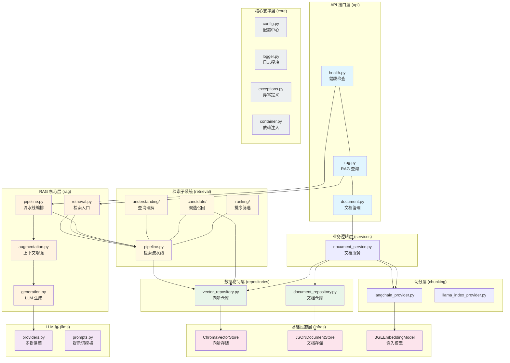
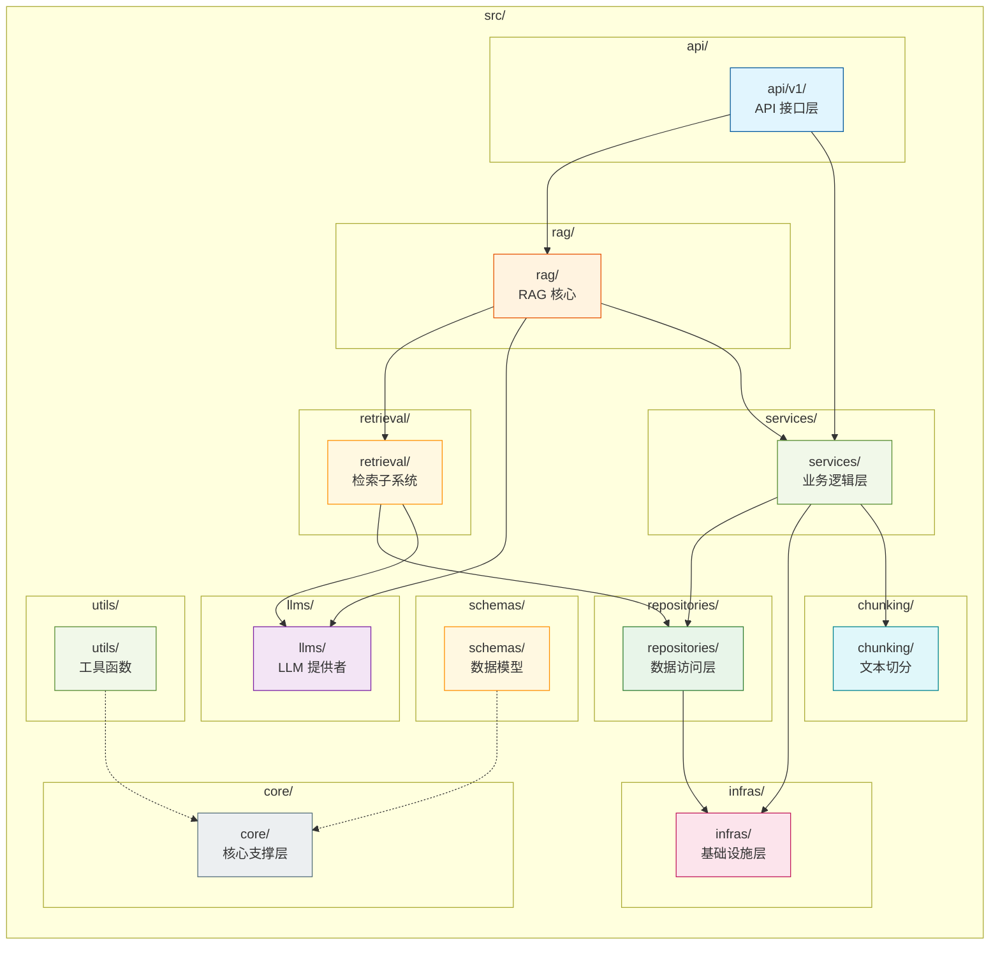
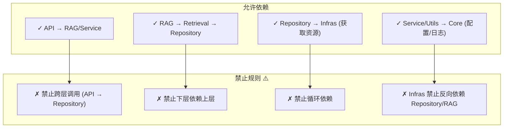

# x-rag: 生产级 RAG 实训项目

[](https://opensource.org/licenses/MIT)
[](https://www.python.org/downloads/)
[](https://github.com/astral-sh/ruff)

> **English**: [README.en.md](./README.en.md)

## 项目简介

x-rag 是一个**生产级 RAG（检索增强生成）学习和实训项目**，遵循后端行业标准化工程实践，提供分层清晰、模块化、高可扩展、易维护的通用服务架构。

### 核心价值

- **分层架构**: 标准五层业务架构 + 通用核心支撑层，完全与 Web 框架隔离
- **模块化设计**: 核心支撑层可复用在 RESTful API、定时任务、消息消费、离线脚本、单元测试等全场景
- **开箱即用**: 支持多环境切换、容器化部署，可快速搭建企业级 RESTful API 后端服务
- **工程规范**: 遵循 PEP8、完整类型注解、生产级日志与异常处理

## 核心特征

- **OOP 检索流水线**: 三阶段可插拔架构（查询理解、候选召回、排序筛选），每阶段均支持多种算法 Provider 灵活替换
- **向量检索**: 支持 Chroma 向量存储，集成 BGE-M3 多语言嵌入模型
- **智能检索**: 支持 MMR、RRF、语义重排等多种排序算法，提升检索多样性
- **灵活切分**: 提供字符级、单词级、句子级、段落级、语义级等多种文本切分策略
- **多 LLM 支持**: 支持 DeepSeek、豆包、阿里云百炼、小米 Mimo 等主流 LLM 提供商
- **依赖注入**: 内置通用 IOC 容器，支持单例/多例模式
- **中间件支持**: CORS、限流、请求追踪、统一异常处理

## 项目结构

```
x-rag/
├── src/                          # 核心源码
│   ├── api/                      # API 接口层
│   │   ├── router.py             # 路由注册
│   │   └── v1/                   # API v1 版本
│   │       ├── health.py          # 健康检查
│   │       ├── rag.py            # RAG 接口
│   │       └── document.py        # 文档管理
│   ├── rag/                      # RAG 核心模块
│   │   ├── pipeline.py           # RAG 流水线编排
│   │   ├── retrieval.py          # 检索入口（委托 Pipeline）
│   │   ├── augmentation.py       # 上下文增强
│   │   └── generation.py         # LLM 生成
│   ├── retrieval/                # 检索子系统（OOP 三阶段）
│   │   ├── pipeline.py           # 检索流水线编排
│   │   ├── understanding/        # Stage 1 — 查询理解
│   │   │   ├── base.py           # 抽象基类
│   │   │   ├── rewrite.py        # 查询重写
│   │   │   ├── expansion.py      # 查询扩展
│   │   │   ├── hyde.py           # HyDE 假设文档
│   │   │   └── subquery.py       # 子查询分解
│   │   ├── candidate/            # Stage 2 — 候选召回
│   │   │   ├── base.py           # 抽象基类
│   │   │   ├── vector_retrieval.py  # 向量检索
│   │   │   └── keyword_retrieval.py  # BM25 关键词检索
│   │   └── ranking/              # Stage 3 — 排序筛选
│   │       ├── base.py           # 抽象基类
│   │       ├── mmr.py            # MMR 多样性重排
│   │       ├── rrf.py            # RRF 排名融合
│   │       ├── semantic.py        # LLM 语义重排
│   │       └── score_filter.py    # 分值阈值过滤
│   ├── llms/                     # LLM 提供者
│   │   ├── providers.py          # 多提供商注册（DeepSeek/豆包/阿里/Mimo）
│   │   └── prompts.py            # 提示词模板管理
│   ├── chunking/                 # 文本切分
│   │   ├── base.py               # 切分抽象基类
│   │   ├── langchain_provider.py  # LangChain 切分
│   │   └── llama_index_provider.py # LlamaIndex 切分
│   ├── repositories/             # 数据访问层
│   │   ├── base_repository.py   # 基础仓库类
│   │   ├── vector_repository.py  # 向量仓库
│   │   └── document_repository.py # 文档仓库
│   ├── models/                   # ORM 实体层
│   │   ├── document.py           # 文档实体
│   │   └── vector.py             # 向量记录
│   ├── infras/                   # 基础设施层
│   │   ├── vector_store/        # 向量存储
│   │   ├── document_store/       # 文档存储
│   │   └── embedding/            # 嵌入模型
│   ├── core/                     # 核心支撑层
│   │   ├── config.py            # 配置中心
│   │   ├── logger.py            # 日志模块
│   │   ├── exceptions.py         # 异常定义
│   │   └── container.py         # 依赖注入容器
│   ├── schemas/                  # 数据模型
│   │   ├── rag.py               # RAG 相关 Schema
│   │   ├── document.py          # 文档相关 Schema
│   │   └── health.py            # 健康检查 Schema
│   ├── constants/                # 常量定义
│   │   ├── rag.py               # RAG 常量
│   │   ├── generation.py         # 生成常量
│   │   └── ...
│   ├── utils/                    # 工具函数
│   │   ├── similarity.py         # 相似度计算引擎
│   │   ├── filters.py           # 元数据过滤引擎
│   │   ├── index_optimizer.py   # 向量索引优化
│   │   ├── reranker.py          # 重排序工具
│   │   └── text_splitter.py     # 文本切分工具
│   └── main.py                   # 应用入口
├── tests/                        # 测试用例
├── examples/                     # 示例代码
├── scripts/                      # 运维脚本
├── docs/                         # 项目文档
├── .github/workflows/            # GitHub Actions
├── .pre-commit-config.yaml     # Pre-commit 配置
├── config.yaml                  # 配置文件
├── .env.example                 # 环境变量模板
├── docker-compose.yml           # Docker 编排
├── Dockerfile                   # Docker 镜像
├── pyproject.toml              # 项目配置（uv）
├── CHANGELOG.md               # 变更日志
├── LICENSE                     # MIT 协议
└── README.md                  # 本文档
```

## 系统架构

### 检索流水线架构（核心亮点）

```
用户查询
    │
    ▼
┌─────────────────────────────────────────────────────────┐
│  Stage 1: 查询理解（并行执行 → merge 合并）               │
│                                                         │
│  ┌──────────────┐ ┌──────────────┐ ┌──────────────┐   │
│  │ QueryRewrite │ │QueryExpansion│ │    HyDE      │   │
│  │  (LLM 重写)   │ │(同义词/向量扩展)│ │(假设文档)     │   │
│  └──────────────┘ └──────────────┘ └──────────────┘   │
│  ┌──────────────┐                                      │
│  │SubqueryDecomp│                                      │
│  │  (子查询分解)  │                                      │
│  └──────────────┘                                      │
│                        ↓ merge()                        │
│             processed_query + sub_queries                │
│             + expanded_terms + hypothetical_doc          │
└─────────────────────────────────────────────────────────┘
    │
    ▼
┌─────────────────────────────────────────────────────────┐
│  Stage 2: 候选召回（多路并行 → 去重合并）                 │
│                                                         │
│  ┌──────────────────────┐  ┌──────────────────────┐    │
│  │ ChromaVectorRetrieval│  │   BM25Retriever      │    │
│  │   (向量 ANN 检索)     │  │   (关键词 BM25)       │    │
│  └──────────────────────┘  └──────────────────────┘    │
│                        ↓ 候选文档集合                     │
└─────────────────────────────────────────────────────────┘
    │
    ▼
┌─────────────────────────────────────────────────────────┐
│  Stage 3: 排序筛选（依次执行）                           │
│                                                         │
│  MMRReranker ──→ RRFReranker ──→ SemanticReranker      │
│  (多样性重排)    (排名融合)       (语义评分)               │
│                        ↓                                │
│                   ScoreFilter (阈值过滤)                  │
│                        ↓                                │
│              最终 Top-K 检索结果                          │
└─────────────────────────────────────────────────────────┘
```

### 分层架构图



### 模块依赖关系图



### 依赖规则说明



## 快速开始

### 环境要求

- Python 3.11+
- uv（推荐）或 pip

### 克隆项目

```bash
git clone https://github.com/yeyushilai/x-rag.git
cd x-rag
```

### 安装依赖

```bash
# 使用 uv（推荐）
uv sync

# 或使用 pip
pip install -e .
```

### 配置环境

```bash
# 复制环境变量模板
cp .env.example .env

# 编辑 .env，填入你的 API Key
DEEPSEEK_API_KEY=your-deepseek-api-key-here
```

### 启动服务

```bash
# 开发模式（热重载）
uv run uvicorn src.main:app --reload

# 或使用脚本
./scripts/start.sh   # Linux/macOS
.\scripts\start.ps1  # Windows
```

服务启动后访问:
- API 文档: http://localhost:8000/docs
- ReDoc: http://localhost:8000/redoc

### Docker 部署

```bash
# 构建并启动
docker-compose up -d

# 查看日志
docker-compose logs -f
```

## 常用命令

```bash
# 运行测试
uv run pytest tests/

# 代码格式化
uv run ruff check src/ --fix
uv run ruff format src/

# 类型检查
uv run mypy src/

# 安装预提交钩子
uv run pre-commit install
```

## 技术栈

| 类别 | 技术 |
|------|------|
| Web 框架 | FastAPI + Uvicorn |
| 数据存储 | Chroma (向量数据库) |
| 嵌入模型 | BGE-M3 (智源开源) |
| LLM | DeepSeek / 豆包 / 阿里云百炼 / 小米 Mimo |
| 文本切分 | LangChain / LlamaIndex |
| 日志 | Loguru |
| 依赖注入 | 自研 IOC 容器 |
| 工具库 | Pydantic, httpx, rank-bm25 |
| 容器化 | Docker, docker-compose |
| CI/CD | GitHub Actions |
| 包管理 | uv |

## API 文档

### 健康检查

```bash
GET /api/v1/health
```

### 文档管理

```bash
# 上传文档
POST /api/v1/documents/upload

# 列出文档
GET /api/v1/documents

# 获取文档
GET /api/v1/documents/{document_id}

# 删除文档
DELETE /api/v1/documents/{document_id}

# 获取文档状态
GET /api/v1/documents/{document_id}/status
```

### RAG 查询

```bash
# RAG 问答
POST /api/v1/rag/query

# 仅检索
POST /api/v1/rag/retrieve

# 文本向量化
POST /api/v1/rag/embed

# 统计信息
GET /api/v1/rag/stats
```

## 检索子系统使用指南

检索子系统 `src/retrieval/` 支持灵活插拔，典型使用方式：

```python
from retrieval.pipeline import RetrievalPipeline
from retrieval.understanding.rewrite import LLMQueryRewriter
from retrieval.understanding.expansion import EmbeddingExpander
from retrieval.candidate.vector_retrieval import ChromaVectorRetrieval
from retrieval.ranking.mmr import MMRReranker
from retrieval.ranking.score_filter import ScoreFilter
from utils.similarity import SimilaritySearchEngine, DistanceType

pipeline = RetrievalPipeline(
    understanding_providers=[
        LLMQueryRewriter(provider_name="deepseek"),
        EmbeddingExpander(embedding_model=embedding_model),
    ],
    candidate_providers=[
        ChromaVectorRetrieval(),
    ],
    reranking_providers=[
        MMRReranker(distance_type=DistanceType.COSINE),
        ScoreFilter(threshold=0.7),
    ],
    similarity_engine=SimilaritySearchEngine(distance_type=DistanceType.COSINE),
    default_top_k=5,
    default_threshold=0.7,
)

pipeline.initialize()
results = pipeline.retrieve(
    query="查询 RAG 相关内容",
    top_k=5,
    use_mmr=True,
    mmr_lambda=0.5,
)
```

## 许可证

本项目基于 [MIT License](./LICENSE) 开源。

## 联系方式

- 作者: John Young (夜雨诗来)
- 邮箱: john.young@foxmail.com
- Gitee: https://gitee.com/yeyushilai
- GitHub: https://github.com/yeyushilai

## 参考资料

- [Python](https://docs.python.org/3.11/)
- [FastAPI](https://fastapi.tiangolo.com/)
- [uv](https://github.com/astral-sh/uv)
- [Chroma](https://docs.trychroma.com/)
- [Sentence Transformers](https://www.sbert.net/)
- [Pydantic](https://docs.pydantic.dev/)
- [rank-bm25](https://github.com/dorianbrown/rank_bm25)
